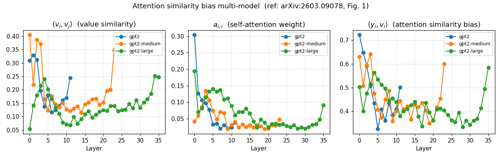

# xsa_POC

A minimal experiment that replicates Figure 1 of the paper
*Exclusive Self Attention* (Zhai, Apple 2026 arXiv:2603.09078)
on GPT-2 variants using TransformerLens.

**This is a learning project.**
Not production-ready, not optimized.

## Why

The paper identifies an *attention similarity bias* in standard Transformers:
the attention output $y_i$ ends up pointing in the same direction as the
token's own value vector $v_i$, layer after layer.
This means SA wastes capacity copying a token's own information instead of
aggregating context which is its actual job.

This POC measures that bias on real models to see whether the paper's findings
hold at smaller scale and on a different training setup (WebText vs FineWeb).

## What it measures

Three quantities from Figure 1 of the paper, for each attention layer:

| Panel | Quantity | What it tells you |
| --- | --- | --- |
| Left | $\langle v_i, v_j \rangle$ avg pairwise cosine sim of value vectors | how correlated value vectors are within a sequence |
| Middle | $a_{i,i}$ avg diagonal of attention pattern | how much each token attends to itself |
| Right | $\langle y_i, v_i \rangle$ avg cosine sim of attention output and self value | the bias itself |

The attention similarity bias is defined as the cosine similarity between
the attention output and the token's own value vector:

$$\langle y_i, v_i \rangle = \frac{y_i \cdot v_i}{\|y_i\| \|v_i\|}$$

where $y_i = \sum_{j=1}^{i} a_{i,j} v_j$ is the standard SA output.

Note: the first token (t=0) is excluded from the averages of panels 2 and 3.
With causal masking the first token can only attend to itself, so $a_{0,0} = 1$
and $y_0 = v_0$ by construction. Including it would inflate both metrics with
a value that has nothing to do with the phenomenon studied here.

## Setup

```
pip install transformer_lens matplotlib datasets
python main.py
```

No GPU required. Runs on CPU; expect ~1–3 min for all three models.

## Models

Configured in `config.py`:

```
MODELS  = ["gpt2", "gpt2-medium", "gpt2-large"]  # 117M, 345M, 774M
N_SEQS  = 32
SEQ_LEN = 128
```

Input: 32 sequences × 128 tokens sampled from the wikitext-2 test split.

## Results

The paper (1.3B, RoPE, FineWeb) reports a **monotonically increasing**
trend with depth. GPT-2 shows a **U-shape**: bias is highest in early
layers, drops toward the middle, then rises slightly at the end.



| Model | Layer 0 | Min | Last layer | Trend (last − first) |
| --- | --- | --- | --- | --- |
| gpt2 (117M, 12L)        | 0.7217 | 0.3250 (L5)  | 0.5013 | −0.22 |
| gpt2-medium (345M, 24L) | 0.6294 | 0.3493 (L19) | 0.5988 | −0.03 |
| gpt2-large (774M, 36L)  | 0.5030 | 0.3335 (L28) | 0.5842 | +0.08 |

The trough sits around 42% of depth in gpt2 and around 80% in gpt2-medium
and gpt2-large.

The "last − first" trend column is interesting on its own: it goes from
clearly negative (gpt2) to flat (medium) to clearly positive (large).
If you only looked at first vs last layer, the larger the model the more
it agrees with the paper's increasing trend. The U-shape in the middle
is what the paper does not predict.

$a_{i,i}$ stays low (<0.05) in deep layers, so GPT-2 does not self-attend
heavily in depth. The late-layer rise in $\langle y_i, v_i \rangle$ tracks
the rise in value vector similarity (panel 1), suggesting it comes from
$v_j$ geometry rather than from self-attention directly.

gpt2-medium and gpt2-large both show a sharp final-layer rise visible in
all three panels (the orange spike at L23 in medium is the most extreme
case). This is likely a side-effect of the last layers approaching the
unembedding matrix rather than the attention similarity bias described
by the paper, but I leave it open.

Possible causes of the divergence from the paper: WebText + learned
positional embeddings (GPT-2) vs FineWeb + RoPE (paper); SEQ_LEN 128 vs
2048; training recipe; attention sink effects in early layers; the
phenomenon may emerge more clearly at >1B scale.

## Files

```
config.py    models, sequence count, seed, output path
data.py      wikitext-2 loader, reproducible chunking
measure.py   single forward pass, hooks on hook_v / hook_pattern / hook_z
report.py    per-layer table with trend arrows
plot.py      3-panel figure matching paper layout
main.py      loop over models, gc between runs
```

## References

Zhai Exclusive Self Attention, arXiv:2603.09078, Apple 2026.
arxiv.org/abs/2603.09078

Nanda et al. TransformerLens.
github.com/TransformerLensOrg/TransformerLens

## Connect with me

[LinkedIn](https://www.linkedin.com/in/francescopl/) · [Kaggle](https://www.kaggle.com/francescopaolol)

